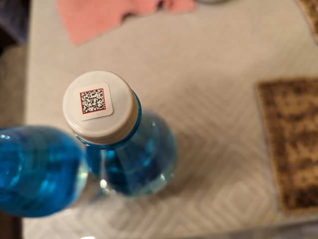
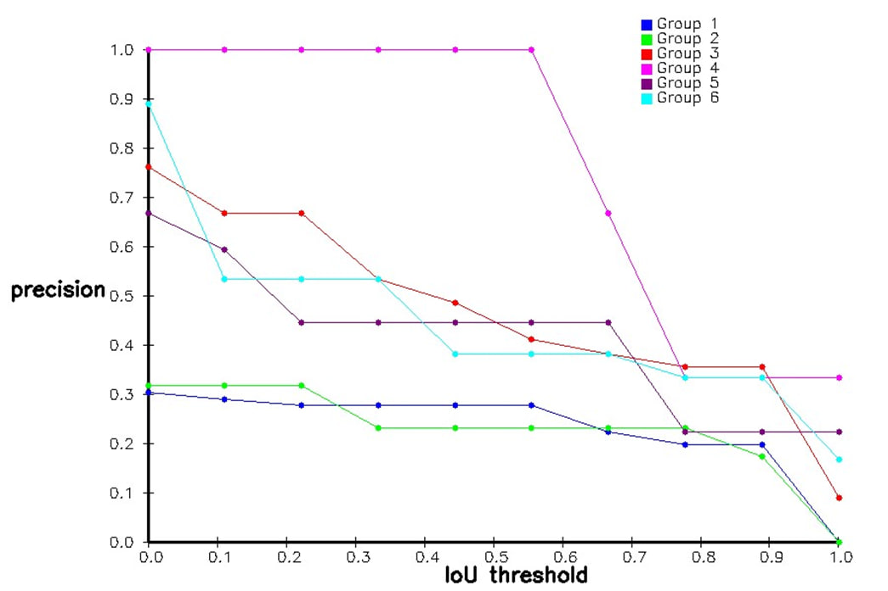
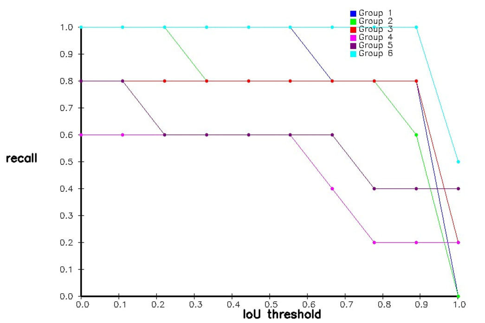
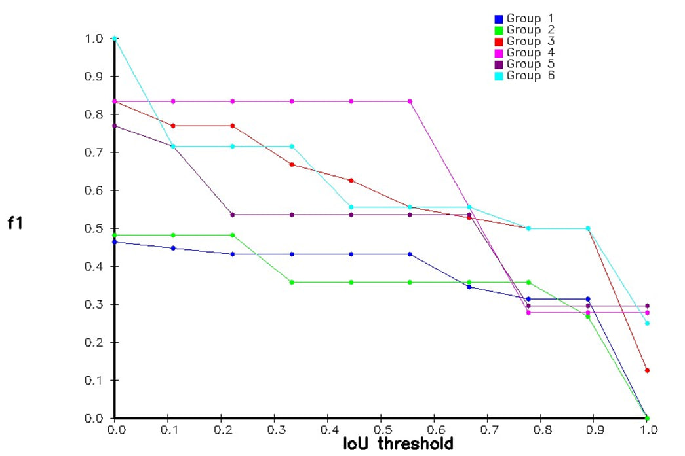

# Smkrep's Datamatrix Detector

This repo contains a C++/OpenCV-based simple datamatrix detector, which is aimed at performing detection on non-preprocessed photos taken by regular devices such as mobile phone cameras. Additionaly, a custom dataset, which was originally collected by me, is also provided for testing purposes. The implementation of this detector's algorithm was developed based on [this research](https://ideas.repec.org/a/hin/jnlmpe/515296.html) by Huang, Qiang & Chen, Wen-Sheng Huang Xiao-Yan & Zhu, Yingying. (2012) and was originally made as a university project

# Dataset

The dataset consists of 40 images taken with the help of Google Pixel 7 smaptphone. Each image contains one or multiple datamatrix codes. Every image is either **4080x3072** or **964x1280** in terms of resolution. Each barcode can appear rotated, blurred, geometrically distorted, be under poor lighting or even all at once. Every barcode can have either simple or complex background 

# Requirements

In order to build and run this application it is required to have:

- **C++17**
- **CMake 3.20 or newer**
- **OpenCV 4.9.0**

# Installation manual

1. Clone the repo and command `cmake -B ./build` to configure the project
2. Command `cmake --build ./build --config Release` to build the Release config of the project
3. Command `cmake --install ./build --prefix path` with `path` being the desired installation path, which is set to `./build/install` by default
4. Go to *installation_path/img_dataset* and unpack the archive with the sample dataset to where you would like to store it.

# User manual

The program has two modes: **detection** and **evaluation**

## Detection mode

Running program in this mode will result in it outputting all processed photos with the detections marked as red rectangles. In addition, for every image a JSON-files with the detection rectangles' coordinates will be generated. These can be used in evaluation mode later on. The example of a processed photo can be seen below:

To run the program in detection mode command the following (example command is for PowerShell):

`.\detector.exe -t=det input_dir output_dir`, where:

- `t` is the mode flag. For the detection mode it should be set to `det`
- `input_dir` is the path to the directory with the sample images and ground_truth JSON-files. If not overridden, defaults to `./img_dataset`
- `output_dir` is the path to the directory where you would like to see images with detected barcodes and JSON-files with detection data. If not overridden, defaults to `./detections`

## Evaluation mode

This mode ideally requires at least 5-6 images with ground truth and detection info. Running program in this mode will result in it evaluating detection performance using precision, recall and F1-Score. The input is roughly split into 6 batches, which then participate in calculation of previously mentioned metrics for every value of Intersection Over Union between ground truth and detection from the interval **[0.01, 0.81]** with a **0.01** step. The calculated values are then displayed in the console and plotted on three graphs, which can be seen below. The graphs are created with the capabilities of OpenCV

To run the program in evaluation mode command the following (example command is for PowerShell):

`.\detector.exe -t=val input_gt input_det`, where:

- `t` is the mode flag. For the evaluation mode it should be set to `val`
- `input_gt` is the path to the directory where the ground_truth JSON-files are stored. If not overridden, defaults to `./img_dataset`
- `input_det` is the path to the directory where the JSON-files with detection data are stored. If not overridden, defaults to `./detections`

